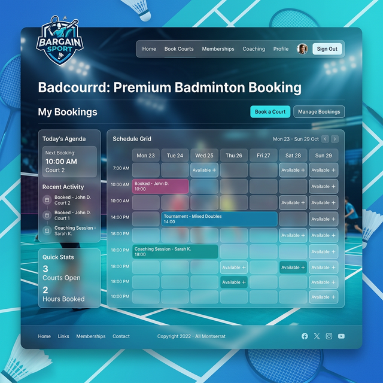

# 🏸 Badcourd — BARGAIN SPORT
### *The Ultimate Badminton Court Management Solution*



**Badcourd** เป็นระบบบริหารจัดการคอร์ตแบดมินตันแบบครบวงจร (Badminton Court Booking & Management System) ที่ออกแบบมาเพื่อช่วยให้เจ้าของสนามแบดมินตันทำงานได้ง่ายขึ้น และลูกค้าได้รับประสบการณ์การจองที่ราบรื่น พัฒนาด้วย PHP 8.2 และ MySQL 8.0 พร้อมรองรับการรันผ่าน Docker อย่างเต็มรูปแบบ

---

## ✨ Key Features

### 📅 ระบบการจองและตารางเวลา
*   **Real-time Timetable:** แสดงตารางคอร์ตรายชั่วโมงแบบเรียลไทม์ เห็นสถานะว่าง/จองได้ทันที
*   **Flexible Booking:** ฟอร์มจองที่ฉลาด ค้นหาสมาชิกอัตโนมัติจากเบอร์โทร และรองรับการเลือกชื่อกรณีเบอร์เดียวหลายคน
*   **Payment Verification:** ระบบอัปโหลดสลิปหลักฐานการชำระเงิน พร้อมระบบ Preview ในตัว
*   **Dynamic Pricing:** คำนวณราคาอัตโนมัติตามกฎราคา (Peak/Off-peak, วันธรรมดา/วันหยุด) และรองรับคอร์ตประเภท VIP

### 👥 ระบบสมาชิก (Loyalty Program)
*   **Auto-Registration:** สมัครสมาชิกให้ลูกค้าโดยอัตโนมัติในการจองครั้งแรก
*   **Tiered Membership:** ระบบระดับสมาชิก 4 ระดับ (Bronze, Silver, Gold, Platinum) คำนวณจากยอดสะสม
*   **Reward Points:** บันทึกคะแนนสะสมอัตโนมัติ (฿100 = 1 Point)
*   **Automated Discounts:** ให้ส่วนลดตามระดับสมาชิกโดยตรง (สูงสุด 15%)

### 🎟️ ระบบโปรโมชั่น
*   **Promo Codes:** สร้างรหัสส่วนลดกำหนดช่วงเวลาและเปอร์เซ็นต์ได้
*   **Real-time Validation:** ตรวจสอบรหัสโปรโมชั่นทันทีผ่าน AJAX
*   **Conflict Management:** ระบบป้องกันการใช้ส่วนลดซ้อนกันระหว่างสมาชิกและโปรโมชั่น

### 📊 ระบบหลังบ้านและการรายงาน
*   **Full CRUD Admin:** จัดการคอร์ต, สมาชิก, ผู้ใช้งานระบบ และโปรโมชั่น ได้ง่ายๆ
*   **Pricing Management:** ปรับแต่งกฎราคาตามวันและเวลาได้อย่างอิสระ
*   **Excel Export:** ส่งออกข้อมูลการจองตามช่วงวันที่ต้องการเพื่อทำรายงาน

---

## 🛠 Tech Stack

| Component | Technology |
|---|---|
| **Language** | PHP 8.2 |
| **Database** | MySQL 8.0 |
| **Frontend** | Tailwind CSS (Modern Responsive UI) |
| **Logic** | Vanilla JavaScript + AJAX |
| **Infrastructure** | Docker + Docker Compose |
| **Server** | Apache (mod_php) |

---

## 🚀 Getting Started

### Prerequisites
*   [Docker Desktop](https://www.docker.com/products/docker-desktop/) installed on your machine.

### Installation & Setup

1.  **Clone the Repository**
    ```bash
    git clone https://github.com/B0atByte/Badcourd.git
    cd Badcourd
    ```

2.  **Start Services**
    ```bash
    docker-compose up -d
    ```

3.  **Database Migration**
    Import SQL files in `SQL/` folder in the following order:
    ```bash
    docker exec -i mysql-db mysql -u root -prootpassword badcourt < SQL/badcourt.sql
    docker exec -i mysql-db mysql -u root -prootpassword badcourt < SQL/members_system.sql
    docker exec -i mysql-db mysql -u root -prootpassword badcourt < SQL/promotions_system.sql
    docker exec -i mysql-db mysql -u root -prootpassword badcourt < SQL/pricing_groups_migration.sql
    docker exec -i mysql-db mysql -u root -prootpassword badcourt < SQL/slip_migration.sql
    ```

4.  **Install Dependencies**
    ```bash
    docker exec php-app composer install
    ```

---

## 🔑 Access Information

| Service | URL | Credentials |
|---|---|---|
| **Web Application** | [http://localhost:8085](http://localhost:8085) | Admin: `admin`/`admin` |
| **phpMyAdmin** | [http://localhost:8081](http://localhost:8081) | DB: `badcourt` |

---

## 📂 Project Structure

```text
BARGAIN_SPORT/
├── admin/          # Management modules
├── auth/           # Authentication logic
├── bookings/       # Booking & Pricing core
├── config/         # Environment & DB configs
├── includes/       # Layouts & Helpers
├── members/        # Member operations
├── SQL/            # Migration files
└── assets/         # UI Assets & Media
```

---

## 📝 License

© 2025 **B0atByte** — BARGAIN SPORT. All rights reserved.

